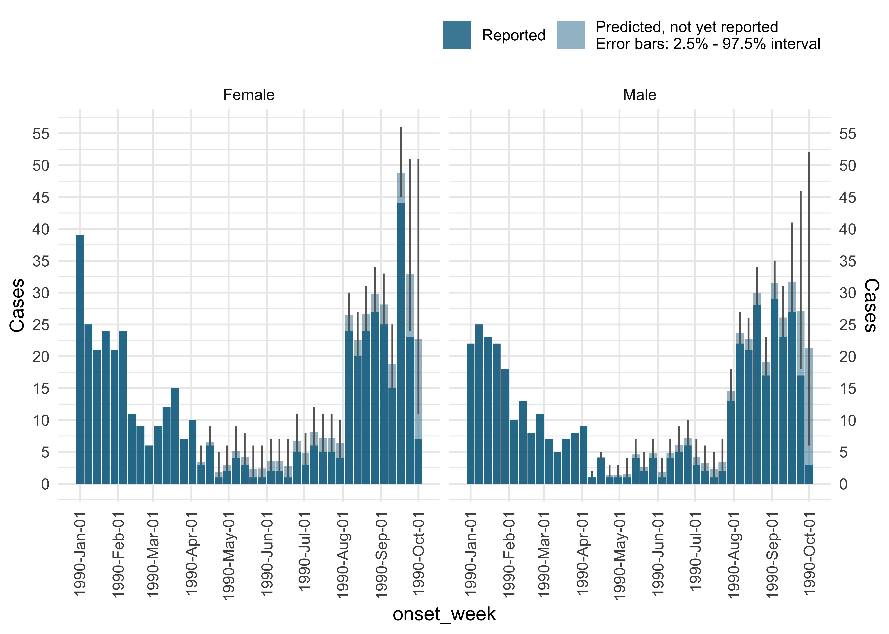

<!-- README.md is generated from README.Rmd. Please edit that file -->

# diseasenowcasting

<!-- badges: start -->

[](https://CRAN.R-project.org/package=diseasenowcasting)
[](https://app.codecov.io/gh/RodrigoZepeda/diseasenowcasting)
[](https://github.com/RodrigoZepeda/diseasenowcasting/actions/workflows/R-CMD-check.yaml)
[](https://lifecycle.r-lib.org/articles/stages.html#experimental)
<!-- badges: end -->

## Example

``` r
library(diseasenowcasting)
set.seed(32658235)

# Create a fake disease process
num_steps  <- 15
num_strata <- 2
num_delays <- 10
sims       <- simulate_process_for_testing(num_steps = num_steps, 
                                           num_strata = num_strata, num_delays = num_delays)

# Now use model to predict disease process. If no strata is required omit the strata option
predictions <- nowcast(sims, "onset_date", "report_date", strata = ".strata",
                       method = "variational")
#> Chain 1: ------------------------------------------------------------
#> Chain 1: EXPERIMENTAL ALGORITHM:
#> Chain 1:   This procedure has not been thoroughly tested and may be unstable
#> Chain 1:   or buggy. The interface is subject to change.
#> Chain 1: ------------------------------------------------------------
#> Chain 1: 
#> Chain 1: 
#> Chain 1: 
#> Chain 1: Gradient evaluation took 0.002572 seconds
#> Chain 1: 1000 transitions using 10 leapfrog steps per transition would take 25.72 seconds.
#> Chain 1: Adjust your expectations accordingly!
#> Chain 1: 
#> Chain 1: 
#> Chain 1: Begin eta adaptation.
#> Chain 1: Iteration:   1 / 250 [  0%]  (Adaptation)
#> Chain 1: Iteration:  50 / 250 [ 20%]  (Adaptation)
#> Chain 1: Iteration: 100 / 250 [ 40%]  (Adaptation)
#> Chain 1: Iteration: 150 / 250 [ 60%]  (Adaptation)
#> Chain 1: Iteration: 200 / 250 [ 80%]  (Adaptation)
#> Chain 1: Success! Found best value [eta = 1] earlier than expected.
#> Chain 1: 
#> Chain 1: Begin stochastic gradient ascent.
#> Chain 1:   iter             ELBO   delta_ELBO_mean   delta_ELBO_med   notes 
#> Chain 1:    100        -1298.581             1.000            1.000
#> Chain 1:    200        -1204.906             0.539            1.000
#> Chain 1:    300        -1201.901             0.360            0.078
#> Chain 1:    400        -1200.774             0.270            0.078
#> Chain 1:    500        -1198.517             0.217            0.003   MEDIAN ELBO CONVERGED
#> Chain 1: 
#> Chain 1: Drawing a sample of size 1000 from the approximate posterior... 
#> Chain 1: COMPLETED.
#> Warning: Pareto k diagnostic value is 2.16. Resampling is disabled. Decreasing
#> tol_rel_obj may help if variational algorithm has terminated prematurely.
#> Otherwise consider using sampling instead.

#Get the predicted values in a nice format
predicted_values <- predictions$generated_quantities |>
  posterior::as_draws() |>
  posterior::subset_draws("N_predict") |>
  posterior::summarise_draws() |>
  dplyr::mutate(.strata = as.numeric(stringr::str_remove_all(variable,".*\\[.*,|\\]"))) |>
  dplyr::mutate(.tval = as.numeric(stringr::str_remove_all(variable,".*\\[|,.*\\]")))

# Plot everything
library(ggplot2)

# Sum over all delays
data_delays <- sims |>
  dplyr::group_by(.tval, .strata) |>
  dplyr::summarise(n = sum(n)) 

# Create plot
ggplot(data_delays) +
  geom_ribbon(aes(x = .tval, ymin = q5, ymax = q95, fill = as.character(.strata)), 
              data = predicted_values, linetype = "dotted", alpha = 0.5) +
  geom_line(aes(x = .tval, y = n, color = as.character(.strata))) +
  geom_line(aes(x = .tval, y = mean, color = as.character(.strata)), 
            data = predicted_values, linetype = "dotted") +
  theme_bw() +
  scale_color_manual("Strata", values = c("tomato3", "forestgreen")) +
  scale_fill_manual("Strata", values = c("tomato3", "forestgreen")) +
  labs(
    x = "Time",
    y = "Cases"
  )
```


