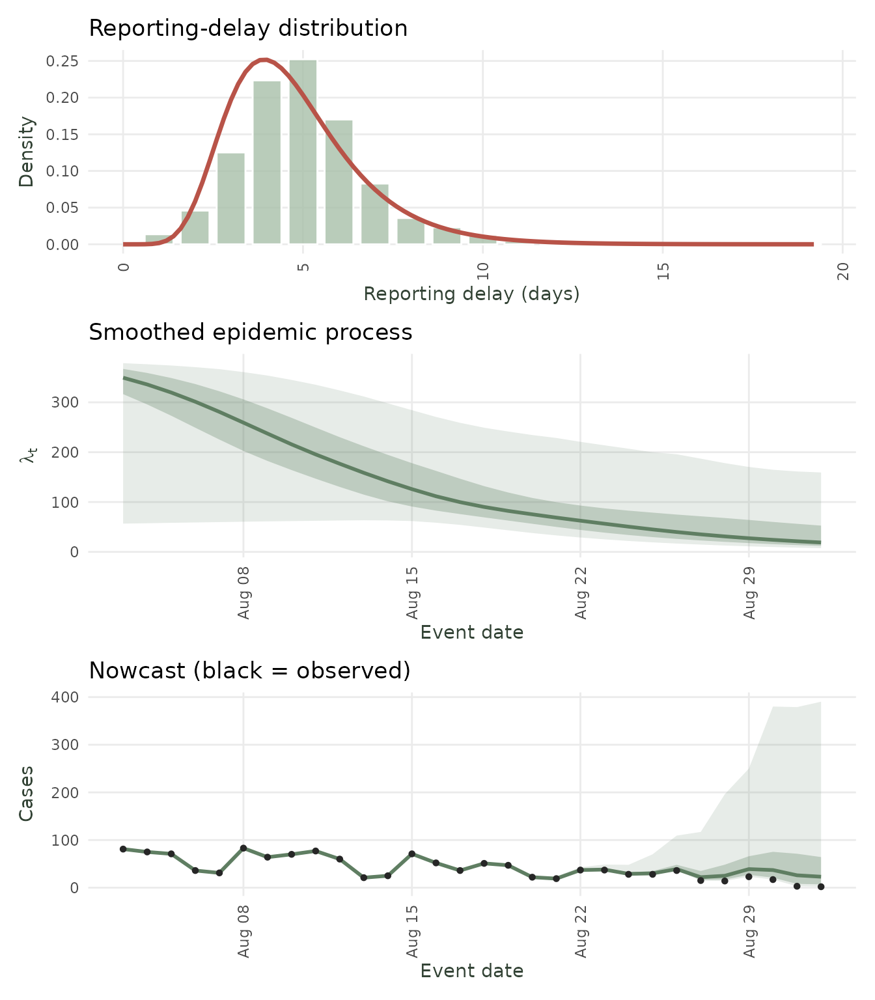

# Custom Delays and Epidemic Processes

`diseasenowcasting` is a **model-agnostic nowcasting framework**. A
nowcast here is built from three pieces:

- A **likelihood**,

- An **epidemic process**, and

- A **reporting-delay distribution**.

You can either pick a built-in for the **epidemic** and the **delay** or
**supply your own**.

This vignette shows how to extend the epidemic and delay processes to
custom models via two examples based on a real dataset:

- A **custom delay distribution** (Weibull), fit to weekly **dengue**
  surveillance
  ([`tbl.now::denguedat`](https://rodrigozepeda.github.io/tbl.now/reference/denguedat.html));
  and

- a **custom epidemic process** (hand-written SIR model), fit to the
  2022 **mpox** outbreak
  ([`tbl.now::mpoxdat`](https://rodrigozepeda.github.io/tbl.now/reference/mpoxdat.html)).

### The one rule: `RTMB`

To fit, the package needs the gradient of the likelihood with respect to
the parameters. It gets this automatically via automatic differentiation
(AD) through the [RTMB](https://github.com/kaskr/RTMB)) package. If you
are unfamiliar with it here are some basic rules:

1.  **Write your function in plain arithmetic.** Use `+`, `-`, `*`, `/`,
    `exp`, `log`, `sqrt`, `abs`, `sum`, `cumsum`, `pnorm`, `pgamma`, and
    fixed-length `for` loops (loops that depend on sample size or time
    but not on a parameter).

2.  **Avoid conditioning on parameters** Never use `if`/`ifelse` on a
    *parameter value* nor `pmax`/`pmin` on parameters. There are always
    work around such as using `(x + abs(x))/2` for `pmax(x, 0)`.

3.  **Don’t use** random draws nor external solvers (e.g. for
    differential equations or optimization). `deSolve` can be used via
    the additional [`RTMBode`
    library](https://kaskr.r-universe.dev/RTMBode).

> **Note** Each extension has a **validator**
> ([`validate_custom_delay()`](https://rodrigozepeda.github.io/diseasenowcasting/reference/validate_custom_delay.md),
> [`validate_custom_epidemic()`](https://rodrigozepeda.github.io/diseasenowcasting/reference/validate_custom_epidemic.md)).
> It checks your function for possible errors. The validator is not
> perfect and might raise false-positive flags (i.e. functions that do
> work on RTMB might crash the validator). So if you know what you are
> doing feel free to ignore it.

``` r

set.seed(26378)
library(diseasenowcasting)
library(tbl.now)
library(RTMB) # <--------- REQUIRED for custom components 
library(ggplot2)
library(dplyr)
```

## 1. Custom delay: Weibull

### The data

`denguedat` is a weekly dengue line-list from Puerto Rico (`onset_week`,
`report_week`). We take one season and build a `tbl_now`, which carries
the two time indices the nowcast needs:

``` r

#Get just one season for making the example fast
dengue_season <- denguedat |> 
  filter(report_week  <= as.Date("1991-06-01") & 
           onset_week <= as.Date("1991-06-01"))

#Construct the tbl_now
dengue_tn <- tbl_now(dengue_season,
                     event_date  = onset_week,
                     report_date = report_week,
                     data_type   = "linelist",
                     verbose     = FALSE)
```

### The custom part: a Weibull delay

You describe the delay through its [cumulative distribution function
(CDF)](https://en.wikipedia.org/wiki/Cumulative_distribution_function)
`F(d)`. Each piece is written as a function of a parameter vector named
`theta` that **returns a function of the delay** `d`.

> **Note** `theta` represents a transformation of the parameters so that
> they are unconstrained (\theta \in \mathbb{R}^k. It might not be equal
> to the ‘usual’ parameters as we explain below.

| Argument | Meaning | Weibull form | Required? |
|----|----|----|----|
| `cdf(theta)` | returns `function(d)` = F(d) = \Pr(\text{delay} \le d) | 1 - \exp(-(d/\lambda)^k) | **yes** |
| `log_cdf(theta)` | returns `function(d)` = \log F(d) | defaults to \log(\text{cdf}) | no |
| `log_survival(theta)` | returns `function(d)` = \log(1 - F(d)) | -(d/\lambda)^k | no |

Only `cdf` is required; `log_cdf` and `log_survival` default to the
obvious transforms of `cdf`. It is worth supplying `log_survival` and
`log_cdf` explicitly for numerical stability. For example, the default
`log(1 - cdf)` loses precision as F \to 1, whereas for the Weibull
`log_survival = -(d/\lambda)^k` is exact. We work on the **log scale**
(`theta[1] = log k`, `theta[2] = log lambda`) so the optimizer is
unconstrained.

``` r

weibull_cdf <- function(theta) {
  shape <- exp(theta[1])   # k > 0
  scale <- exp(theta[2])   # lambda > 0
  function(d) 1 - exp(-(d / scale)^shape)
}

weibull_log_survival <- function(theta) {
  shape <- exp(theta[1])   # k > 0
  scale <- exp(theta[2])   # lambda > 0
  function(d) -(d / scale)^shape         # exact log(1 - F), stable in the tail
}
```

Pass them to
[`custom_delay()`](https://rodrigozepeda.github.io/diseasenowcasting/reference/custom_delay.md).
The arguments:

- **`cdf`** (and optionally **`log_cdf`**, **`log_survival`**) — the
  functions above.
- **`priors`** — a list with one entry per parameter, in `theta` order.
  Each entry is **either** a prior (a free parameter, estimated) **or**
  a single number (fixed).
- **`name`**, **`param_names`**, **`inits`** — labels and
  (unconstrained-scale) starting values.

``` r

weibull_delay <- custom_delay(
  cdf          = weibull_cdf,
  log_survival = weibull_log_survival,
  priors       = list(normal_prior(0, 1), normal_prior(log(3), 1)),
  name         = "Weibull",
  param_names  = c("log_shape", "log_scale"),
  inits        = c(0, log(3))
)
validate_custom_delay(weibull_delay)
```

### Fit it (and a built-in to compare against)

The Generalized Gamma reduces **exactly** to a Weibull when its shape
parameter `Q = 1`, so `generalized_gamma_delay(Q = 1)` is a perfect
built-in cross-check for our custom delay:

``` r

#Custom delay
nc_weibull  <- nowcast(dengue_tn,
                       model(likelihood = nb_likelihood(),
                             epidemic   =  ar1_epidemic(), 
                             delay      = weibull_delay),
                       temporal_effects = "none")

#Using the Generalized Gamma from the package
nc_gengamma <- nowcast(dengue_tn,
                       model(likelihood = nb_likelihood(), 
                             epidemic   = ar1_epidemic(), 
                             delay      = generalized_gamma_delay(Q = 1)),
                       temporal_effects = "none")
```

The two coincide confirming the custom delay matches a known
distribution:

Show plotting code

``` r

delay_grid <- seq(0.5, 20, by = 0.5)
pmf <- function(shape, scale)
  stats::pweibull(delay_grid + 0.5, shape, scale) -
  stats::pweibull(pmax(0, delay_grid - 0.5), shape, scale)

#Get the fitgted parameyters
theta_w <- as.numeric(nc_weibull@fits[[1]]$parList$custom_delay_params)
mu_g    <- nc_gengamma@fits[[1]]$reconstruct$delay_mu
sig_g   <- nc_gengamma@fits[[1]]$reconstruct$delay_sigma

compare_df <- rbind(
  data.frame(delay = delay_grid, p = pmf(exp(theta_w[1]), exp(theta_w[2])), model = "Custom Weibull"),
  data.frame(delay = delay_grid, p = pmf(1 / sig_g, exp(mu_g)),            model = "GenGamma (Q=1)")
)
ggplot(compare_df, aes(delay, p, colour = model, linetype = model)) +
  geom_line(linewidth = 1.1) +
  scale_colour_manual(values = c("Custom Weibull" = "#2166AC", "GenGamma (Q=1)" = "#D6604D")) +
  labs(x = "Reporting delay (weeks)", y = "Probability mass",
       title = "Custom Weibull vs. built-in GenGamma(Q = 1)", colour = NULL, linetype = NULL) +
  theme_minimal(base_size = 13) + theme(legend.position = "bottom")
```


Fitted reporting-delay distribution: custom Weibull vs. the built-in
GenGamma(Q=1), which is algebraically the same Weibull.

And the nowcast itself, using the custom delay:

``` r

autoplot(predict(nc_weibull, seed = 246))
```


Dengue nowcast with the custom Weibull delay (median + 50/90%
intervals).

## 2. Custom epidemic: different SIR

A custom epidemic is just **one function** `intensity_fn(theta)` that
returns the log expected-incidence matrix `log_mean[n_time × n_strata]`.
How you generate it (regression, random walk, ODE, …) is up to you.

### The data

`mpoxdat` is daily count data from the 2022 US mpox outbreak. We pool
the race strata into one series and build a `tbl_now`:

``` r

mpox_tn <- tbl_now(mpoxdat,
                   event_date  = dx_date,
                   report_date = dx_report_date,
                   case_count  = n,
                   data_type   = "count-incidence",
                   verbose     = FALSE,
                   now         = as.Date("2022/09/01"))
```

The SIR loop runs over every event-time, so we need `max_time` (the
number of event-times the model spans) before writing the function.
[`infer_max_time()`](https://rodrigozepeda.github.io/diseasenowcasting/reference/infer_max_time.md)
reads it off the data:

``` r

max_time <- infer_max_time(mpox_tn)
```

### The custom part: an SIR epidemic

**This is the code that matters.** A discrete-time SIR with susceptibles
(`S`) and infectious (`I`) evolving on a daily basis. The modelled
incidence is the new infections `beta·S·I/N`. The parameters
`(R0, gamma, I0)` are again on the log scale (unconstrained).

``` r

sir_intensity_fn <- function(theta) {
  #Assigning in a for loop a vector requires this:
  `[<-`     <- RTMB::ADoverload("[<-")         
  
  #We define R0, gamma and I0 as the parameters we are adjusting:
  R0        <- exp(theta[1])   #Basic reproductive number
  gamma     <- exp(theta[2])   #1 / infectious rate
  I0        <- exp(theta[3])   #Initial infected
  
  #The total size of the population is constant:
  N         <- 1e5
  
  #Initial values for S and I
  S         <- N - I0
  I         <- I0
  
  #Beta (for force of infection)
  beta      <- R0 * gamma / N
  
  #Empty vector where we'll store the incidence. Has to be instantiated in RTMB
  incidence <- numeric(max_time)

  #Only loops that don't depend on parameters are allowed.
  #Here we loop through a constant (time) which is valid
  for (t in seq_len(max_time)) {

    new_inf      <-  beta * S * I
    incidence[t] <- new_inf

    #Rest of the model
    S <- S - new_inf
    I <- I + new_inf - gamma * I
  }
  # log of pmax(incidence, 0), AD-safe, guarding log(0):
  matrix(log((incidence + abs(incidence)) * 0.5 + 1e-8), max_time, 1L)
}
```

Wrap it in
[`custom_epidemic()`](https://rodrigozepeda.github.io/diseasenowcasting/reference/custom_epidemic.md)
(same argument shape as
[`custom_delay()`](https://rodrigozepeda.github.io/diseasenowcasting/reference/custom_delay.md)):

``` r

custom_sir_epidemic <- custom_epidemic(
  intensity_fn = sir_intensity_fn,
  priors       = list(normal_prior(log(1.5), 0.4),   # log R0
                      normal_prior(log(0.1), 0.3),   # log gamma
                      normal_prior(log(5),   1.0)),  # log I0
  name         = "SIR",
  param_names  = c("log_R0", "log_gamma", "log_I0"),
  inits        = c(log(1.5), log(0.1), log(5))
)
validate_custom_epidemic(custom_sir_epidemic)
```

### Fit it

``` r

nc_sir_custom  <- nowcast(mpox_tn,
                          model(likelihood = nb_likelihood(), 
                                epidemic   = custom_sir_epidemic, 
                                delay      = lognormal_delay()),
                          temporal_effects = "none")
```

And observe the results:

``` r

autoplot(nc_sir_custom)
```


mpox nowcast with the custom SIR epidemic (median + 50/90% intervals).

## 3. Summary: Tips for writing your own component

1.  **Parametrize on the unconstrained scale.** Use `exp(theta[i])` for
    positive quantities, `plogis(theta[i])` for probabilities. Give the
    initial values `inits` on that same scale.
2.  **A custom epidemic represents the whole `log_mean`.** Include any
    baseline level. Use all covariates you need. Nothing (no intercept,
    no covariates) is added on top after you set it.
3.  **Know `max_time` first** if your function loops over time.
    `infer_max_time(tn)` gives the number of event-times the model
    spans.
4.  **Use `[<-` to accumulate vectors** Use
    `` `[<-` <- RTMB::ADoverload("[<-") `` only when a loop must fill a
    pre-allocated vector (e.g. an ODE).
5.  **Guard `log` of near-zero values** The
    `log((x + abs(x)) * 0.5 + 1e-8)` we used is a numerically-safe way
    to calculate the maximum and avoid `log(0)`.
6.  **Validate before fitting** —
    [`validate_custom_delay()`](https://rodrigozepeda.github.io/diseasenowcasting/reference/validate_custom_delay.md)
    /
    [`validate_custom_epidemic()`](https://rodrigozepeda.github.io/diseasenowcasting/reference/validate_custom_epidemic.md)
    help catch code errors early.
7.  **Use other packages**, the `RTMBode` package offers an
    adaptive/stiff solver that plugs into RTMB. Might be helpful for
    more complicated models.

## 4. Advanced: A differential equations epidemic process

> Here we write the epidemic as a **continuous-time SIR ordinary
> differential equation** and let a proper solver integrate it. The
> [`RTMBode`](https://github.com/kaskr/RTMBode) package provides a
> [`deSolve`](https://cran.r-project.org/package=deSolve)-style `ode()`
> that is **differentiable through `RTMB`** (it supplies the adjoint),
> so there is no need to hand-roll an integrator such as Runge–Kutta.

The SIR system is

\frac{dS}{dt} = -\beta\\S\\I, \qquad \frac{dI}{dt} = \beta\\S\\I -
\gamma\\I, \qquad \beta = \frac{R_0\\\gamma}{N},

and the daily incidence is the number of new infections within each day.
We obtain it by adding a **cumulative-infection compartment** C with
dC/dt = \beta\\S\\I; the per-day incidence is then `diff(C)` across the
day boundaries 0, 1, \dots, \texttt{max\\time}.

`RTMBode` is an optional dependency; install it from the kaskr
r-universe:

``` r

install.packages("RTMBode", repos = "https://kaskr.r-universe.dev")
```

``` r

sir_ode_fn <- function(theta) {
  #We define R0, gamma and I0 as the parameters we are adjusting (log scale,
  #so they are always positive):
  R0    <- exp(theta[1])   #Basic reproductive number
  gamma <- exp(theta[2])   #Recovery rate (1 / infectious period)
  I0    <- exp(theta[3])   #Initial infected

  #The total population is constant; beta is the transmission rate:
  N     <- 1e5
  beta  <- R0 * gamma / N

  #The SIR right-hand side, deSolve-style: a function of (time, state, parms)
  #returning the derivatives. We add a compartment C that ACCUMULATES new
  #infections, so the daily incidence is simply diff(C).
  sir_rhs <- function(time, state, parms) {
    with(as.list(c(state, parms)), {
      infection <- beta * S * I
      list(c(-infection,                # dS/dt
              infection - gamma * I,    # dI/dt
              infection))               # dC/dt  (cumulative infections)
    })
  }

  #RTMBode::ode is a deSolve-compatible solver that is differentiable through
  #RTMB (it supplies the adjoint), so we let it integrate the system instead of
  #hand-rolling RK4. Solve at the day boundaries 0, 1, ..., max_time:
  solution  <- RTMBode::ode(
    y     = c(S = N - I0, I = I0, C = 0),
    times = seq.int(0L, max_time),
    func  = sir_rhs,
    parms = c(beta = beta, gamma = gamma)
  )
  incidence <- diff(solution[, "C"])     # new infections within each day

  # log of pmax(incidence, 0), AD-safe, guarding log(0):
  matrix(log((incidence + abs(incidence)) * 0.5 + 1e-8), max_time, 1L)
}
```

The wrapping and fitting are exactly as before:

``` r

sir_ode_epidemic <- custom_epidemic(
  intensity_fn = sir_ode_fn,
  priors       = list(normal_prior(log(1.5), 0.4),
                      normal_prior(log(0.1), 0.3),
                      normal_prior(log(5),   1.0)),
  name         = "SIR-ODE",
  param_names  = c("log_R0", "log_gamma", "log_I0"),
  inits        = c(log(1.5), log(0.1), log(5))
)

#Check the custom model
validate_custom_epidemic(sir_ode_epidemic)

#Do the nowcast
nc_ode <- nowcast(mpox_tn,
                  model(nb_likelihood(), sir_ode_epidemic, lognormal_delay()),
                  temporal_effects = "none")

nowcast_diagnostic(nc_ode)
```


