# Understanding Priors and Hyperparameters in diseasenowcasting

A **prior** is a probability distribution that encodes the beliefs about
a parameter *before seeing the data*. When data is informative (*i.e.*
many cases, long reporting history), the prior has little impact and the
data overwhelms it. When the data is sparse or noisy (early epidemic,
small populations), the prior substantially shapes the estimates.

### Quick reference

Here we show what to change depending on your situation. Examples are
below.

| Priority | Setting(s) | What it Controls | When to Adjust |
|----|----|----|----|
| 1 | `phi` in [`nb_likelihood()`](https://rodrigozepeda.github.io/diseasenowcasting/reference/likelihood.md) (or change to [`poisson_likelihood()`](https://rodrigozepeda.github.io/diseasenowcasting/reference/likelihood.md)) | Interval width (i.e. coverage) | Start here if coverage is off. |
| 2 | [Delay’s parameters](https://rodrigozepeda.github.io/diseasenowcasting/reference/delay_process.html) `mu`, `sigma` and (if applicable) `Q` | How much the most-recent past is inflated. | Change here if nowcasting for previous dates (backcasting) has too wide or too short intervals. |
| 3.a | `ell` (HSGP), `sigma` (AR1) | Trend flexibility near turning points | Adjust when the trend is too rigid or too reactive around inflection points. |
| 3.b | `R0`, `gamma`, `N_eff` (SIR) | Mechanistic epidemic shape | Keep these loose unless you have epidemiological knowledge. |
| 4 | `N_pop` (SIR only) | Population at risk | Changing the definition of the population at risk might change the behavior (*e.g.* for STIs maybe the population at risk is *technically* the whole population but using a subset, such as the sexually-active individuals might yield better results). |
| 5 | `num_basis` (HSGP) | Trend smoothness/complexity (this is not technically a prior). | Increase if the trend looks too smooth; decrease if it looks too noisy. |
| 6 | `covariate_prior` | Strength of covariate effects | Mainly matters when additional covariates are included and have strong effects. |

### What the rest of the vignette shows:

This vignette teaches the impact of the main priors and hyperparameters
of our models. It uses a *tight* prior distribution vs a *loose* diffuse
one and shows how their usage results in different values.

Each figure shows the same three panels, because a parameter can move
one (or more!) of three different things:

| Reporting delay | Smoothed epidemic | Nowcast |
|----|----|----|
| Fitted delay distribution | Modelled epidemic process (unobserved) | Predicted nowcast |

In the nowcast panel, solid grey points are the counts **reported so
far** and hollow points are the **eventually-observed truth**.

For this simulation we use the
[`denguedat`](https://rodrigozepeda.github.io/tbl.now/reference/denguedat.html)
dataset (weekly dengue cases from Puerto Rico). However the qualitative
impact of the priors can be translated to any other disease.

## 1. Likelihood prior: NB precision (`phi`)

The negative-binomial precision `phi` controls how much count
variability is *not* explained by the trend. It is the single biggest
driver of **interval width**. Small precision `phi` results in a very
overdispersed process (wide intervals); a large `phi` is very precise
(tight intervals).

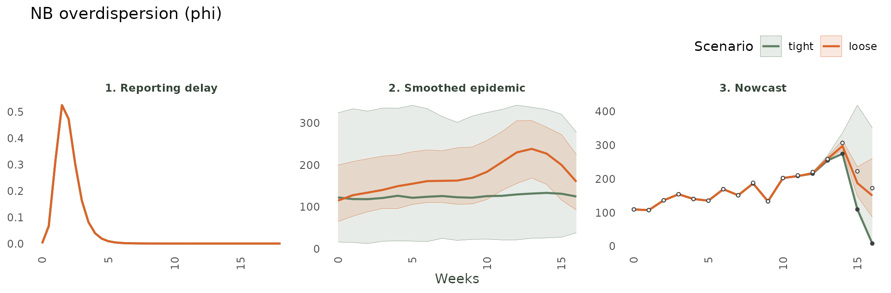

> **What to watch:** `phi`’s main job is the **width** of the epidemic
> process (both nowcast and smoothed epidemic); it barely moves the
> delay (panel 1). If your 90% intervals routinely miss the truth, use a
> smaller `phi` (more overdispersion); if they are too wide, use a
> larger one.

## 2. Reporting-delay parameters

Delay parameters act first on **panel 1** (the fitted delay
distribution) and then propagate to the nowcast (**panel 3**), which
inflates the most-recent counts. Intuitively, if a delay has a heavier
tail, the nowcast will have a wider interval in the past as cases have
more time to arrive.

### 2.1 Log-Normal delay

#### 2.1.1 Location (`mu`)

`mu` is the (log) typical delay in the delay units (i.e. if a delay
usually takes 2 weeks then \mu \approx log(14) if the units are days and
\mu \approx log(2) if units are weeks). A small `mu` implies reports
arrive fast; a large one, a long delay (on average).


> **What to watch:** panel 1 slides left/right with `mu`. If the fitted
> delay is too short the nowcast under-inflates recent weeks (panel 3
> sits too low); too long and it over-inflates.

#### 2.1.2 Scale (`sigma`)

`sigma` (\> 0) is the spread of the log-normal (*i.e.* how concentrated
the delays are). A small sigma implies a sharp spike at the typical
delay; a large value, a heavy tail (\_i.e. more extreme values).

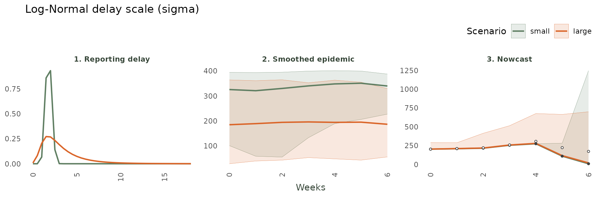

> **What to watch:** `sigma` changes the *shape* of panel 1 without
> moving its centre. A heavier tail means more cases are still expected
> to arrive, so the nowcast propagates its uncertainty throughout the
> recent past. A shorter tail (smaller `sigma`) implies all the
> uncertainty concentrates very close to the `now` of the `nowcast`.

### 2.2 Generalized-Gamma delay

#### 2.2.1 Location (`mu`)

`mu` behaves similar to the Log-Normal location.

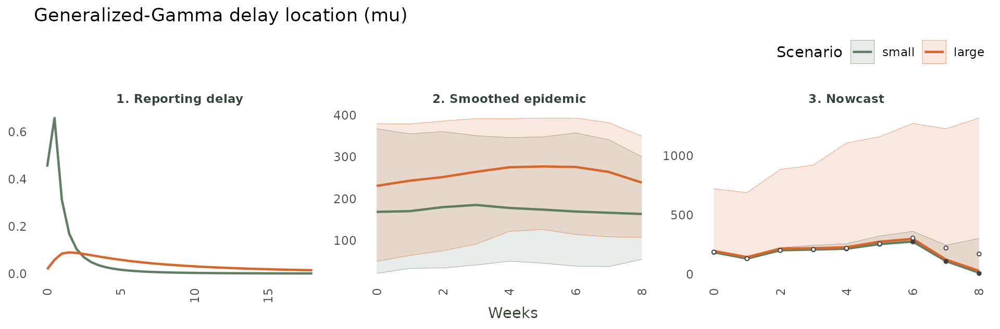

> **What to watch:** as for the Log-Normal, `mu` slides the whole delay
> distribution (panel 1) to shorter or longer delays.

#### 2.2.2 Scale (`sigma`)

`sigma` (\> 0) controls the spread around the location.


> **What to watch:** small `sigma` concentrates the delay; large `sigma`
> disperses it, widening the right tail.

#### 2.2.3 Tail shape (`Q`)

`Q` interpolates the tail. A small value implies a light tail; a large
value, a heavy one.

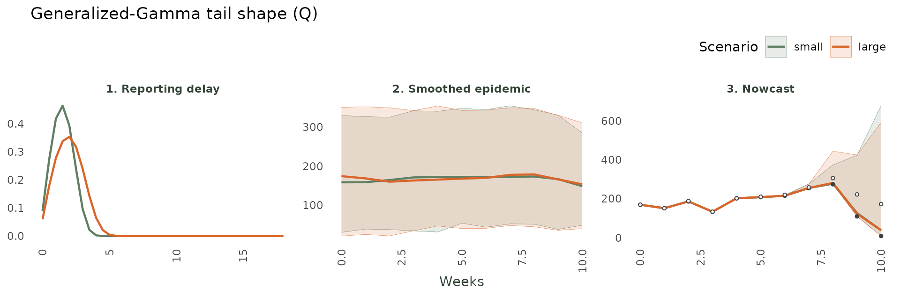

> **What to watch:** `Q` reshapes the *tail* of panel 1 while leaving
> the bulk roughly fixed. A heavier tail makes more late reports
> possible.

### 2.3 Dirichlet (non-parametric) delay

#### 2.3.1 Concentration (`alpha`)

The Dirichlet delay learns a free histogram. A small value (\< 1) lets
it spike on only a few delays; a large one pushes it towards assigning
positive probability to more values.

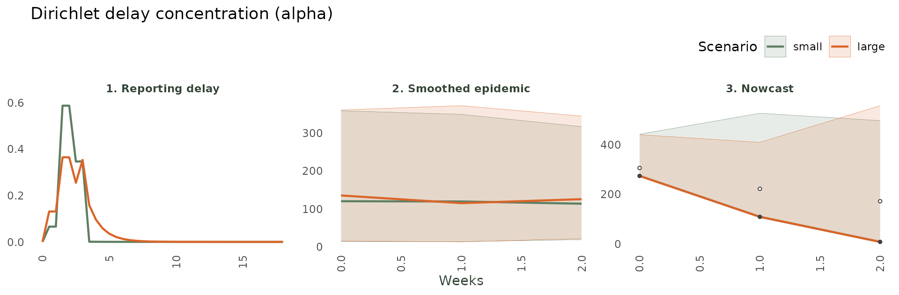

> **What to watch:** panel 1 shows the effect. A small `alpha` lets the
> delay spike on a handful of observed delays; a large `alpha` lets more
> delays be possible. A large value will always be more susceptible to
> noise.

## 3. Epidemic-process parameters

The epidemic process is the smooth latent trend the nowcast
extrapolates. The package offers three: the flexible **HSGP**, the
simpler **AR(1)**, and the mechanistic **SIR**.

### 3.1 HSGP

#### 3.1.1 Amplitude (`alpha`)

`alpha` as the Gaussian Process amplitude dictates how far the latent
trend may swing. Small values imply a flatter trend; larger lets it
squiggle more.

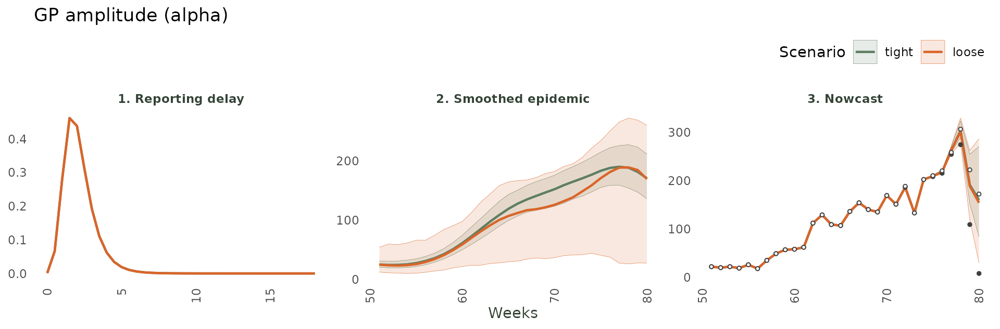

> **What to watch:** the amplitude controls the height of the latent
> trend (panel 2) and therefore the width of the nowcast (panel 3); the
> delay (panel 1) is untouched.

#### 3.1.2 Length-scale (`ell`)

`ell` is the GP length-scale (i.e. the horizontal “wavelength” of the
trend). Small values imply a wiggly and quick to bend epidemic process;
large ones long and smooth catching less variation.

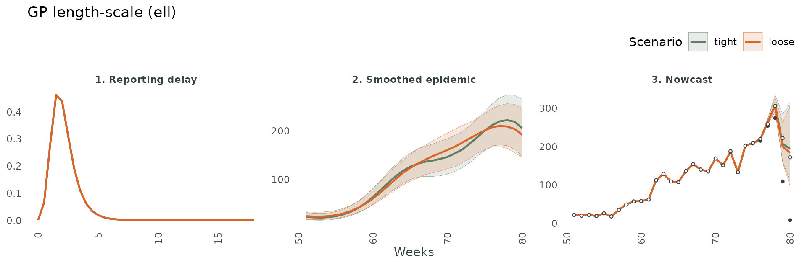

> **What to watch:** a short value lets the trend bend sharply through
> the peak (panel 2) at the cost of wiggle; a long one forces a smoother
> curve that can lag turning points.

#### 3.1.4 HSGP: number of basis functions (`num_basis`)

`num_basis` is the **resolution** of the GP. It is a hyperparameter (a
number). The default is automatic set by (~1.5\sqrt{T}) with T being the
maximum time planned to be observed.

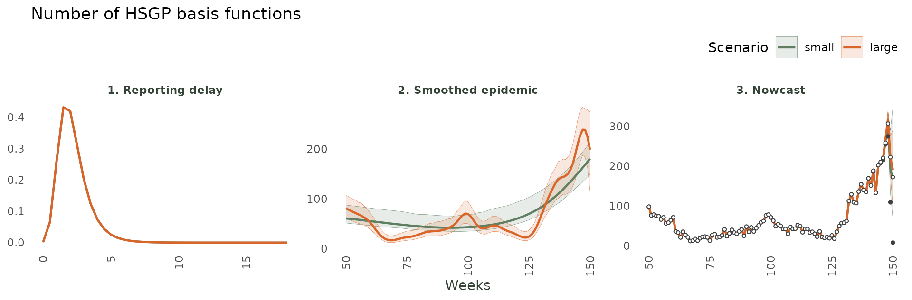

> **What to watch:** few basis functions force an over-smooth trend that
> can lag the peak (panel 2); many let the model track rapid change but
> risk over-fitting noise near the end. The delay (panel 1) is
> unaffected.

### 3.2 AR(1)

#### 3.2.1 Autocorrelation (`phi`)

`phi` represents the persistence of the autoregressive trend. Near 0 it
forgets the past immediately and goes back to the (log) mean of the
epidemic; near 1 it completely depends on the previous value.

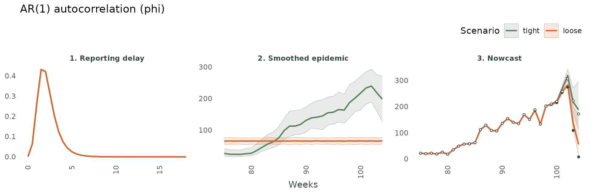

> **What to watch:** A loose `phi` makes recent moves persist into the
> nowcast (panel 2-3); a tight `phi` reverts to the mean quickly.

#### 3.2.2 Innovation SD (`sigma`)

`sigma` (\> 0) is the size of the random step the trend takes each week.
A small value results in a smooth process while a large value is jumpy.

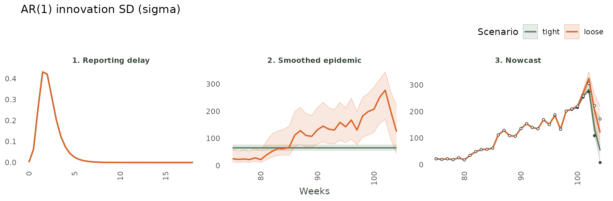

> **What to watch:** A small `sigma` keeps the trend smooth with narrow
> intervals; a large `sigma` lets it wiggle, widening the nowcast.

### 3.3 SIR

#### 3.3.1 Basic reproduction number (`R0`)

`R0` (\> 0) sets how fast a mechanistic SIR epidemic grows. Below 1 it
extinguisges; large values grow extremely fast.

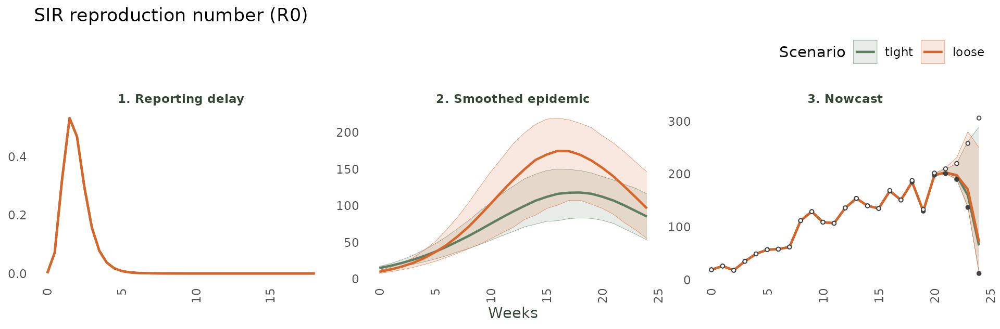

> **What to watch:** `R0` acts through the *shape* of the epidemic curve
> (panel 2) representing how steeply it climbs as well as the final size
> of the epidemic.

#### 3.3.2 Recovery rate (`gamma`)

`gamma` in (0, 1) is the rate people leave the infectious pool
(1/`gamma` represents the mean infectious period). A tight small value
implies a slow recovery, hence a long epidemic as individuals have more
chance to transmit. A large loose value allows individuals to recover
very fast and hence reduce the final-size of the epidemic.

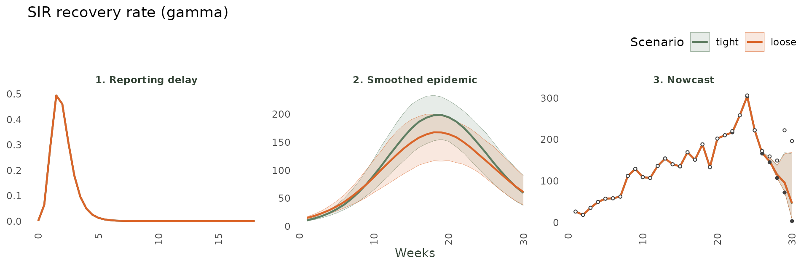

> **What to watch:** `gamma` sets the epidemic’s *duration* and the
> speed of its decline (panel 2), so it is shown a few weeks past the
> peak.

#### 3.3.3 Susceptible fraction (`N_eff`)

`N_eff` in (0, 1) is the fraction of the population that is actually at
risk. A small value is a tiny pool. The epidemic saturates fast and at a
lower peak. A large value implies a longer epidemic with more
individuals getting infected.

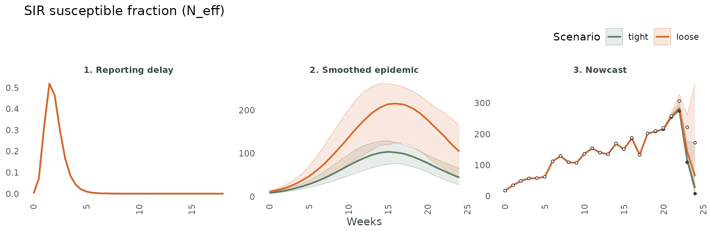

> **What to watch:** `N_eff` sets the size of the susceptible pool and
> hence the peak’s height (panel 2).

#### 3.3.4 Total population (`N_pop`)

`N_pop` is the assumed total population. This is a hyperparameter hence
a number.

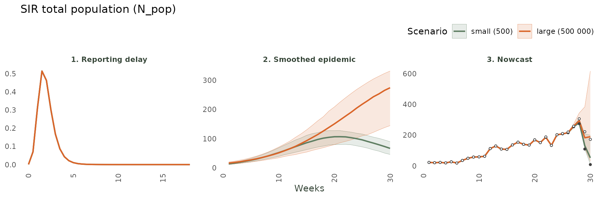

> **What to watch:** a small `N_pop` saturates the susceptible pool
> quickly (short, smaller peak); a large one lets the epidemic grow
> slowly over more time (longer, larger peak).

## 4. Covariate priors (`covariate_prior`)

When temporal effects (seasonality, day-of-week) are attached to a
[`nowcast()`](https://rodrigozepeda.github.io/diseasenowcasting/reference/nowcast.md)
call, each effect column becomes a covariate.
`model(covariate_prior = ...)` sets a shared prior on every covariate
coefficient. The fits below use weekly dengue data with 52-period
seasonality attached.

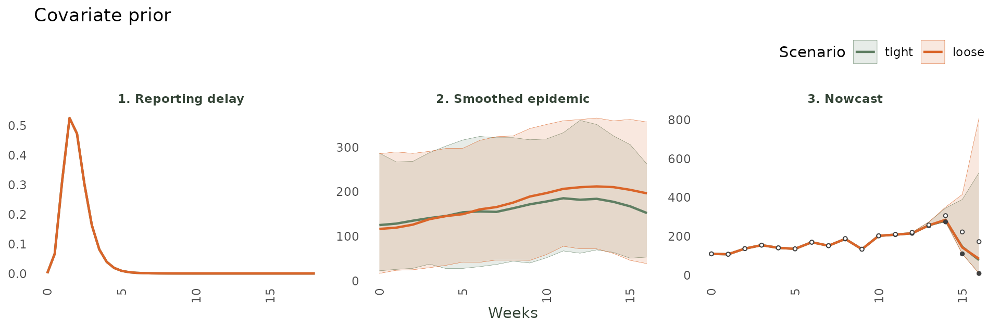

> **What to watch:** a tight prior (near-zero coefficients) forces the
> epidemic process to explain all variation alone. A loose prior lets
> the  
> covariates pull the curve up or down strongly.

## 5. Practical guide

To set any parameter in a
[`model()`](https://rodrigozepeda.github.io/diseasenowcasting/reference/model.md)
you can do either of two things:

1.  Pass a **number** to fix it (constant prior), or

2.  Pass a `*_prior()` object to give it a prior.

``` r

# Fix values you know (numbers):
mdl <- model(nb_likelihood(), hsgp_epidemic(num_basis = 5),
             lognormal_delay(mu = log(2)))

# Or give priors (tight = confident, loose = diffuse):
mdl <- model(nb_likelihood(phi = lognormal_prior(log(5), 0.5)),
             hsgp_epidemic(alpha = half_normal_prior(0, 5)),
             lognormal_delay(mu = normal_prior(log(7), 0.1)))

# Inspect what the defaults resolve to:
default_priors(model(nb_likelihood(), hsgp_epidemic(), lognormal_delay()))
```

See also the summary at the beginning of this vignette for specific
steps.
