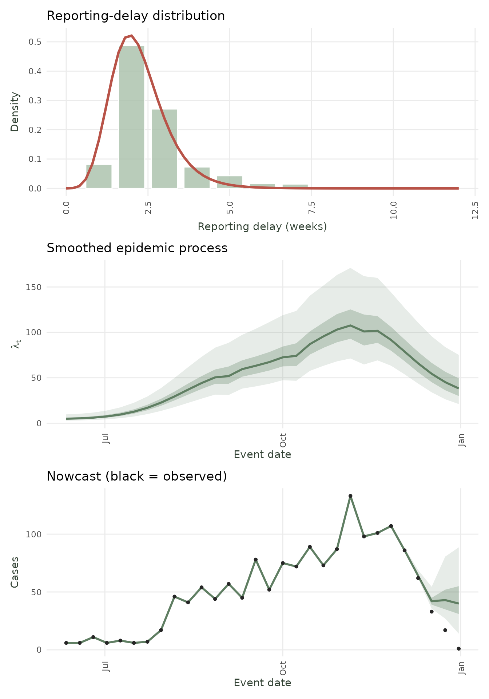
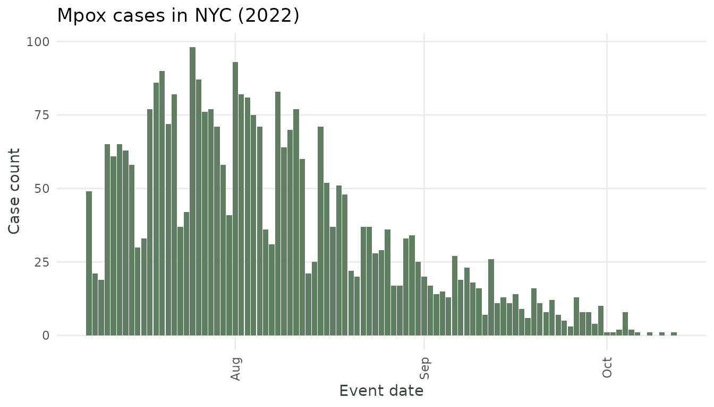
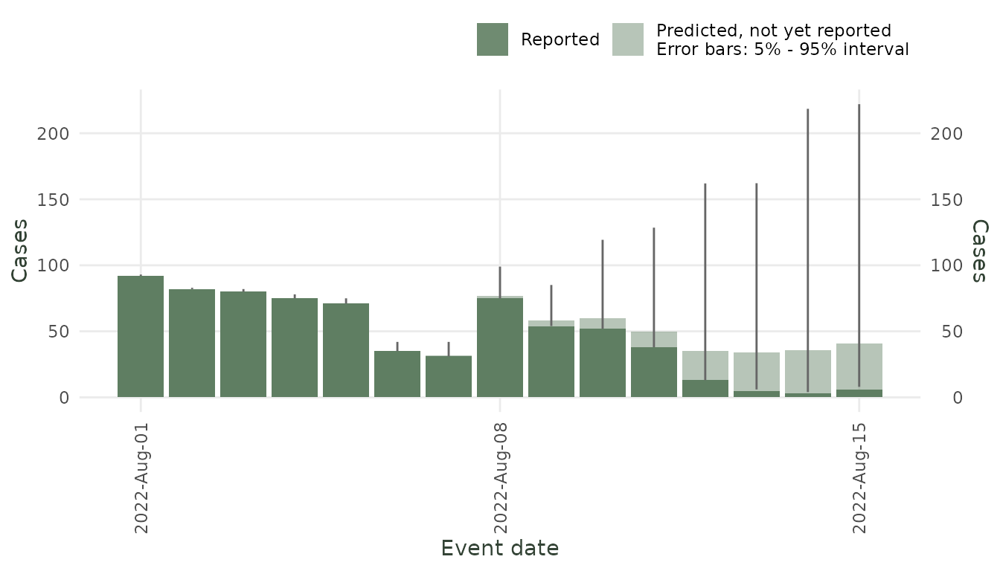
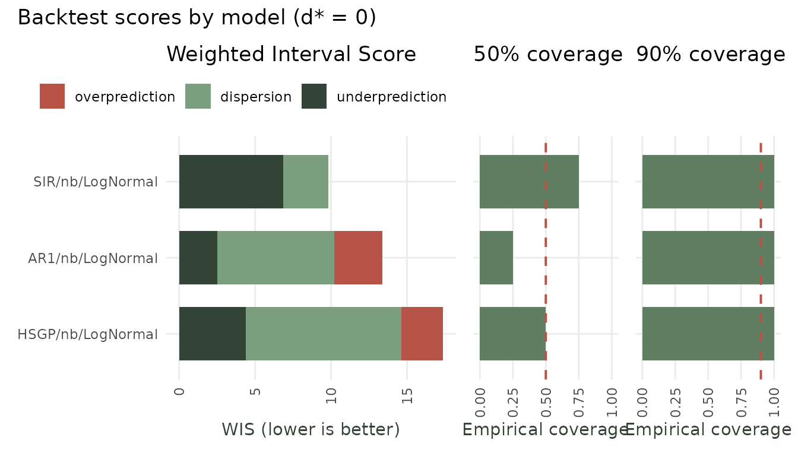
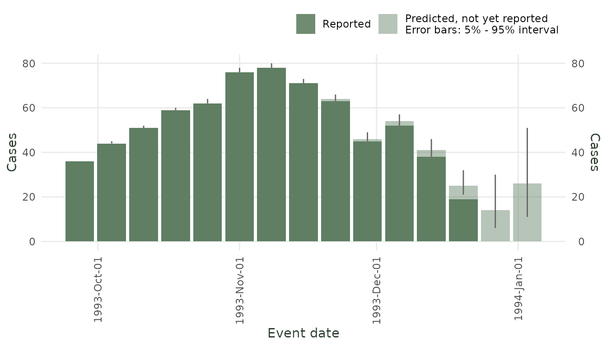

# Introduction to diseasenowcasting: Real-Time Epidemic Nowcasting

`diseasenowcasting` is an R package for nowcasting time series of
epidemiological cases. Epidemiologic surveillance tools usually have an
intrinsic delay between the **true date of an event** (`event_date`) and
the **report date for that event** (`report_date`). Some examples
include the true date being symptom onset or testing time and the report
date corresponds to when the case was registered in the system.
`diseasenowcasting` uses censored Bayesian models (via R’s Template
Model Builder
[`RTMB`](https://cran.r-project.org/web/packages/RTMB/index.html)) to
infer the cases that have not yet been reported thus providing a
prediction of the final number of cases.

## Your data: the `tbl_now` format

`diseasenowcasting` works with data organised as a `tbl_now` object from
the companion [`tbl.now`](https://rodrigozepeda.github.io/tbl.now/)
package. A `tbl_now` is simply a data frame that has been annotated with
the roles of its columns:

- *event date* when the event happened (e.g. symptom onset)

- *report date* when the event was reported (e.g. date entered into the
  database)

- *strata* (optional) columns that defined all the strata (e.g. sex and
  region)

- *now* (optional) the date until which to nowcast (assumes all events
  and reports before the now have been observed and missing observations
  correspond to no observations - i.e.  if one day there were not cases
  the missingness can be translated into zero cases)

``` r

library(diseasenowcasting)
library(tbl.now)
library(dplyr)
library(ggplot2)
set.seed(27653)
```

As a quick example, here is how to build a `tbl_now` using the following
surveillance data for dengue in Puerto Rico:

``` r

data(denguedat)
```

    #>   onset_week report_week gender
    #> 1 1990-01-01  1990-01-01   Male
    #> 2 1990-01-01  1990-01-01 Female
    #> 3 1990-01-01  1990-01-01 Female
    #> 4 1990-01-01  1990-01-08 Female
    #> 5 1990-01-01  1990-01-08   Male
    #> 6 1990-01-01  1990-01-15 Female

We can transform the `data.frame` to a `tbl_now` by specifying the event
and report dates (`onset` and `report` weeks respectively) as well as
the `data_type` and the strata (in this case, `gender`).

``` r

dengue_tbl <- tbl_now(
  denguedat,
  event_date  = onset_week,    # symptom onset date
  report_date = report_week,   # when the record was reported
  data_type   = "linelist",    # another option is "count-incidence"  if data is aggregated
  now         =  as.Date("1991-01-01") #When is the now of the nowcast
)
dengue_tbl
#> # A tibble:  52,987 × 6
#> # Data type: "linelist"
#> # Frequency: Event: `weeks` | Report: `weeks`
#>    onset_week   report_week   gender .event_num .report_num .delay
#>    <date>       <date>        <chr>       <dbl>       <dbl>  <dbl>
#>    [event_date] [report_date] [...]       [...]       [...]  [...]
#>  1 1990-01-01   1990-01-01    Male            0           0      0
#>  2 1990-01-01   1990-01-01    Female          0           0      0
#>  3 1990-01-01   1990-01-01    Female          0           0      0
#>  4 1990-01-01   1990-01-08    Female          0           1      1
#>  5 1990-01-01   1990-01-08    Male            0           1      1
#>  6 1990-01-01   1990-01-15    Female          0           2      2
#>  7 1990-01-01   1990-01-15    Female          0           2      2
#>  8 1990-01-01   1990-01-15    Female          0           2      2
#>  9 1990-01-01   1990-01-22    Female          0           3      3
#> 10 1990-01-01   1990-01-08    Female          0           1      1
#> # ────────────────────────────────────────────────────────────────────────────────
#> # Now: 1991-01-01 | Event date: "onset_week" | Report date: "report_week"
#> # ────────────────────────────────────────────────────────────────────────────────
#> # ℹ 52,977 more rows
```

Once your data is a `tbl_now`, a single call to
[`nowcast()`](https://rodrigozepeda.github.io/diseasenowcasting/reference/nowcast.md)
does the rest.

> For more information about `tbl_now` check [the package’s
> website](https://rodrigozepeda.github.io/tbl.now/index.html).

## Example 1 – Dengue fever (setting up a stratified nowcast)

We fit a nowcast stratified by gender to illustrate the basic workflow.
First we add the column `gender` as strata to the `tbl_now`:

``` r

dengue_tbl <-  dengue_tbl |>  add_strata(gender)
```

Notice that the `tbl_now` automatically prints the `strata`
specification below:

``` r

dengue_tbl
#> # A tibble:  52,987 × 6
#> # Data type: "linelist"
#> # Frequency: Event: `weeks` | Report: `weeks`
#>    onset_week   report_week   gender   .event_num .report_num .delay
#>    <date>       <date>        <chr>         <dbl>       <dbl>  <dbl>
#>    [event_date] [report_date] [strata]      [...]       [...]  [...]
#>  1 1990-01-01   1990-01-01    Male              0           0      0
#>  2 1990-01-01   1990-01-01    Female            0           0      0
#>  3 1990-01-01   1990-01-01    Female            0           0      0
#>  4 1990-01-01   1990-01-08    Female            0           1      1
#>  5 1990-01-01   1990-01-08    Male              0           1      1
#>  6 1990-01-01   1990-01-15    Female            0           2      2
#>  7 1990-01-01   1990-01-15    Female            0           2      2
#>  8 1990-01-01   1990-01-15    Female            0           2      2
#>  9 1990-01-01   1990-01-22    Female            0           3      3
#> 10 1990-01-01   1990-01-08    Female            0           1      1
#> # ────────────────────────────────────────────────────────────────────────────────
#> # Now: 1991-01-01 | Event date: "onset_week" | Report date: "report_week"
#> # Strata: "gender"
#> # ────────────────────────────────────────────────────────────────────────────────
#> # ℹ 52,977 more rows
```

We can also add temporal effects for example a weekly seasonality (52
seasons) as well as a holiday effect using the `almanac` package:

``` r

library(almanac)

#Specify 52 seasons (weekly) and holidays from the US
t_effects  <- temporal_effects(seasons = 52, holidays = cal_us_federal())

#Add the temporal effects
dengue_tbl <- dengue_tbl |> 
  add_temporal_effects(t_effects)
```

Finally we fit the model:

``` r

nc_dengue <- nowcast(dengue_tbl)
```

The fitted model can be visualized with
[`autoplot()`](https://ggplot2.tidyverse.org/reference/autoplot.html).
Note that the nowcast was already stratified by the strata specified in
the `tbl_now`:

``` r

autoplot(nc_dengue) 
```


*Nowcast for dengue example. The shaded bars show the median while the
errorbar has the 90% credible intervals.*

Values can be obtained via
[`predict()`](https://rdrr.io/r/stats/predict.html) and
[`summary()`](https://rdrr.io/r/base/summary.html):

``` r

# Full posterior-predictive nowcast at every event-time
pred_dengue <- predict(nc_dengue)

#This creates a summary of mean and quantiles
summary(pred_dengue) 
```

    #>         mean median        sd     mad q2.5  q5 q10    q25 q50 q75 q90    q95
    #> 154 108.7795    108  1.966167  1.4826  107 107 107 107.00 108 110 111 112.00
    #> 155  89.2505     89  2.942291  2.9652   86  86  86  87.00  89  91  93  95.00
    #> 156  68.6660     68  5.163504  4.4478   62  63  64  65.00  68  71  75  78.00
    #> 157  47.2860     45 12.477341  7.4130   36  37  38  41.00  45  51  59  65.05
    #> 158  44.6450     41 20.220891 14.8260   23  24  27  32.00  41  52  66  81.05
    #> 159  39.8925     35 23.713121 17.7912   11  13  17  24.75  35  50  69  84.05
    #>       q97.5 .event_num stratum event_date
    #> 154 113.025         47   Total 1990-11-26
    #> 155  97.000         48   Total 1990-12-03
    #> 156  81.025         49   Total 1990-12-10
    #> 157  72.000         50   Total 1990-12-17
    #> 158  94.000         51   Total 1990-12-24
    #> 159  97.000         52   Total 1990-12-31

Additionally the
[`nowcast_diagnostic()`](https://rodrigozepeda.github.io/diseasenowcasting/reference/nowcast_diagnostic.md)
shows the fitted distribution for the delay, the smoothed epidemic
process as well as the aggregated nowcast (for the sum of all strata):

``` r

nowcast_diagnostic(nc_dengue) 
```



## Example 2 – Mpox (modifying the nowcast model)

The `mpoxdat` dataset (also in `tbl.now`) covers the 2022 mpox outbreak
in New York City with daily case counts stratified by race.

``` r

data(mpoxdat)

mpox_tbl <- tbl_now(
  mpoxdat,
  event_date  = dx_date,
  report_date = dx_report_date,
  case_count  = n,
  data_type   = "count-incidence",
  now         =  as.Date("2022-08-15")
) 
```

A simple plot of the data shows that we should be taking into account
day-of-the-week effects:

``` r

autoplot(mpox_tbl)
```



We can also set it again with
[`add_temporal_effects()`](https://rodrigozepeda.github.io/tbl.now/reference/add_temporal_effects.html):

``` r

mpox_tbl <- mpox_tbl |> 
  add_temporal_effects(temporal_effects(day_of_week = TRUE))
```

You can see that the `tbl_now` indicates its computation:

    #> # A tibble:  1,417 × 7
    #> # Data type: "count-incidence"
    #> # Frequency: Event: `days` | Report: `days`
    #>    dx_date      dx_report_date race              n .event_num .report_num .delay
    #>    <date>       <date>         <chr>         <int>      <dbl>       <dbl>  <dbl>
    #>    [event_date] [report_date]  [...]         [cas…      [...]       [...]  [...]
    #>  1 2022-07-08   2022-07-12     Asian             4          0           4      4
    #>  2 2022-07-08   2022-07-12     Black             6          0           4      4
    #>  3 2022-07-08   2022-07-12     Hispanic          6          0           4      4
    #>  4 2022-07-08   2022-07-12     Non-Hispanic…     6          0           4      4
    #>  5 2022-07-08   2022-07-13     Asian             2          0           5      5
    #>  6 2022-07-08   2022-07-13     Black             3          0           5      5
    #>  7 2022-07-08   2022-07-13     Hispanic          8          0           5      5
    #>  8 2022-07-08   2022-07-13     Non-Hispanic…     5          0           5      5
    #>  9 2022-07-08   2022-07-14     Black             1          0           6      6
    #> 10 2022-07-08   2022-07-14     Hispanic          3          0           6      6
    #> # ────────────────────────────────────────────────────────────────────────────────
    #> # Now: 2022-08-15 | Event date: "dx_date" | Report date: "dx_report_date"
    #> # T. effects (lazy): [event_date] day_of_week
    #> # ────────────────────────────────────────────────────────────────────────────────
    #> # ℹ 1,407 more rows

One can also choose between several likelihoods, epidemic processess and
delay distributions and feed it into the
[`model()`](https://rodrigozepeda.github.io/diseasenowcasting/reference/model.md).
Here we use a Susceptible-Infected-Recovered model (SIR) with a delay
that follows a lognormal distribution:

``` r

#Models can be modified via the model() 
mpox_model <- model(likelihood = nb_likelihood(),   #Negative binomial
                    epidemic   = sir_epidemic(),    #SIR model
                    delay      = lognormal_delay()) #Delay distribution

#We can then fit the  model
nc_mpox <- nowcast(mpox_tbl, model = mpox_model)

#And show the nowcast
autoplot(nc_mpox) 
```



## Example 3 – Comparing models with a backtest

A **backtest** reruns nowcasts at multiple historical dates and scores
them against the eventually-observed totals. This lets you compare
between models before committing to one for real-time monitoring.

> The
> [`backtest()`](https://rodrigozepeda.github.io/diseasenowcasting/reference/backtest.md)
> function fits one nowcast per `date` and `model` cell. Those cells run
> in parallel through the [future](https://future.futureverse.org/)
> framework.  
> By default they run sequentially; to use several CPU cores, set a
> [parallel plan](https://future.futureverse.org/reference/plan.html)
> *before* calling
> [`backtest()`](https://rodrigozepeda.github.io/diseasenowcasting/reference/backtest.md):

``` r

library(future)
plan(multisession, workers = 4)   # 4 parallel R sessions
# ... run backtest() ...
plan(sequential)                  # restore serial execution when done
```

In what follows we run a backtest in sequential mode however we strongly
recommend using as many workers in a multisession plan as possible:

``` r

# Compare HSGP (flexible GP trend) vs AR1 (autoregressive trend) 
# and SIR (susceptible, infected, recovered) on mpox
models_to_compare <- list(
  model(nb_likelihood(), hsgp_epidemic(), lognormal_delay()),
  model(nb_likelihood(), ar1_epidemic(),  lognormal_delay()),
  model(nb_likelihood(), sir_epidemic(),  lognormal_delay())
)

#Uncomment this line to use several of your cores
#plan(multisession, workers = 4) 

backtest_mpox <- backtest(
  mpox_tbl,
  models  = models_to_compare,
  n_dates = 5 #Test 3 dates at random from the mpox data
)

#This closes the plan multisession opened above
#plan(sequential)   
```

We can then plot the Weighted Interval Score (WIS) and interval
coverage:

``` r

# Plot scoring metrics
autoplot(backtest_mpox)
```



Or obtain it via
[`score()`](https://rodrigozepeda.github.io/diseasenowcasting/reference/score.md):

``` r

# Rank by Weighted Interval Score (WIS) -- lower is better
score(backtest_mpox)
#>               model       wis overprediction underprediction dispersion
#> 1  SIR/nb/LogNormal  9.811354       0.000000        6.855556   2.955799
#> 2  AR1/nb/LogNormal 13.368333       3.166667        2.500000   7.701667
#> 3 HSGP/nb/LogNormal 17.360035       2.708333        4.402778  10.248924
#>   coverage_50 coverage_90       ape      mse n
#> 1        0.75           1 0.4073142 1660.250 4
#> 2        0.25           1 7.1411720 1260.500 4
#> 3        0.50           1 1.6262153 2064.062 4
```

The
[`score()`](https://rodrigozepeda.github.io/diseasenowcasting/reference/score.md)
output shows WIS, absolute percentage error (APE), and empirical
coverage at 50 % and 90 %. A well-calibrated nowcast should have the
lowest WIS and coverage close to these levels.

> In this specific test we would choose the SIR for having the lowest
> WIS at essentially the same coverage as HGSP. Note however that for
> the tutorial we only used 5 historical dates which is too low to reach
> a definite conslusion.

## Example 4 – Letting the package choose the model (`auto_nowcast()`)

Doing the backtest-and-compare loop by hand (Example 3) is exactly what
[`auto_nowcast()`](https://rodrigozepeda.github.io/diseasenowcasting/reference/auto_nowcast.md)
automates. Given a `tbl_now`, it builds a grid of candidate models
*sized to how much data you have* (which epidemic processes are even
feasible, crossed with the delay families), backtests them, scores them,
and **refits the single best one** on the full data. The result is an
ordinary nowcast, with the ranked comparison stored alongside it.

Here we use all the dengue data up to 1994:

``` r

#All dengue observed as of January 1994
dengue_94 <- denguedat |>
  filter(onset_week  <= as.Date("1994-01-01") &
         report_week <= as.Date("1994-01-01"))

dengue_tbl_94 <- tbl_now(
  dengue_94,
  event_date  = onset_week,
  report_date = report_week,
  data_type   = "linelist",
  now         = as.Date("1994-01-01")
)
```

Backtesting the whole grid is the expensive step. To run the candidates
in parallel, set a
[`future::plan()`](https://future.futureverse.org/reference/plan.html)
before the call and restore it afterwards (left commented here so the
vignette stays single-process):

``` r

# Uncomment to run candidates in parallel:
# library(future)
# plan(multisession, workers = max(parallel::detectCores() - 1, 1))
auto_ncast <- auto_nowcast(
  dengue_tbl_94,
  metric         = "wis",   # rank candidates by Weighted Interval Score
  n_dates        = 10,      # backtest at 10 historical dates (raise for a firmer choice)
  n_draws_select = 150,     # draws while comparing (small => fast)
  n_draws        = 500,     # draws for the final fit of the winner
  K              = 8        # delay imputations (small => fast)
)
# plan(sequential)
```

We can show the scores of the models to see the best performer:

``` r

comparison_scores(auto_ncast)  # every candidate, ranked best-first
#>                      model       wis overprediction underprediction dispersion
#> 1        HSGP/nb/Dirichlet  8.417181     0.11666667        4.148889   4.151625
#> 2        HSGP/nb/LogNormal  8.982736     0.00000000        3.526667   5.456069
#> 3 HSGP/nb/GeneralizedGamma  9.637764     0.03333333        4.218889   5.385542
#> 4         AR1/nb/LogNormal  9.916847     0.11666667        4.375556   5.424625
#> 5         AR1/nb/Dirichlet  9.992472     0.31666667        4.514444   5.161361
#> 6  AR1/nb/GeneralizedGamma 10.547875     0.12222222        5.162778   5.262875
#>   coverage_50 coverage_90       ape     mse  n
#> 1         0.6         1.0 0.3675763 493.150 10
#> 2         0.7         1.0 0.3465956 486.325 10
#> 3         0.4         1.0 0.3737145 542.150 10
#> 4         0.4         0.9 0.4006238 644.775 10
#> 5         0.4         0.9 0.4028097 615.675 10
#> 6         0.5         0.9 0.3991763 727.400 10
```

[`best_model()`](https://rodrigozepeda.github.io/diseasenowcasting/reference/best_model.md)
hands back the winning
[`model()`](https://rodrigozepeda.github.io/diseasenowcasting/reference/model.md)
object, so you can reuse the same specification on other data (or feed
it to
[`nowcast()`](https://rodrigozepeda.github.io/diseasenowcasting/reference/nowcast.md)
/
[`backtest()`](https://rodrigozepeda.github.io/diseasenowcasting/reference/backtest.md)):

``` r

winner <- best_model(auto_ncast)
winner
```

Because the result is a normal nowcast, everything else just works:

``` r

autoplot(auto_ncast)
```


*Nowcast from the model auto_nowcast() selected.*

### Updating the chosen model as new data arrive

The selected nowcast is an ordinary `nowcast_class`, so once
[`auto_nowcast()`](https://rodrigozepeda.github.io/diseasenowcasting/reference/auto_nowcast.md)
has picked a model you keep it and feed it the next batch of reports
with [`update()`](https://rdrr.io/r/stats/update.html) – no need to
re-run the selection. [`update()`](https://rdrr.io/r/stats/update.html)
warm-refits the *same* winning model and scores the incoming reports
against the fitted delay, warning if any arrive far later than expected:

``` r

# A few more weeks of dengue, observed as of 1994-04-01:
dengue_apr <- denguedat |>
  filter(onset_week  <= as.Date("1994-04-01") &
         report_week <= as.Date("1994-04-01"))

dengue_tbl_apr <- tbl_now(
  dengue_apr,
  event_date  = onset_week,
  report_date = report_week,
  data_type   = "linelist",
  now         = as.Date("1994-04-01")
)

auto_ncast_updated <- update(auto_ncast, dengue_tbl_apr)
#> Warning: ! Surprising reporting delay of 11 weeks (1 report): longer than the model
#>   expects (P(D >= d) = 0.0098).
#> ℹ If these are outliers, treat them as censored with `censor_delays_above()`
#>   and re-fit.
#> ℹ See all flagged delays with `extreme_values(nc)`.
```

Any reports with surprising delays are collected by
[`extreme_values()`](https://rodrigozepeda.github.io/diseasenowcasting/reference/extreme_values.md)
(it returns `NULL` when nothing looks off):

``` r

extreme_values(auto_ncast_updated)
#>   delay weight mean_tail_prob cdf_prob    lpd relative_surprise direction
#> 1    11      1       0.009797 0.990203 -6.204            0.0043      long
#>   surprise level
#> 1    delay  0.99
```

See the vignette on [Handling Outlier Delays with
Censoring](https://rodrigozepeda.github.io/diseasenowcasting/articles/Handling_Outlier_Delays_with_Censoring.md)
for what to do when a delay *is* flagged.

## Saving and loading a fitted nowcast

Fitting can take a while, so you will often want to **save** a fitted
nowcast and reload it later – in a report, a dashboard, or a scheduled
job – instead of re-fitting.
[`save_nowcast()`](https://rodrigozepeda.github.io/diseasenowcasting/reference/save_nowcast.md)
writes it to a single `.rds` file and
[`load_nowcast()`](https://rodrigozepeda.github.io/diseasenowcasting/reference/load_nowcast.md)
brings it back.

The autodiff engine (`RTMB`) cannot itself be written to disk, so what
is stored is everything needed to *reuse* the fit: the
[`model()`](https://rodrigozepeda.github.io/diseasenowcasting/reference/model.md)
specification, the input `tbl_now`, and each fit’s parameters together
with its Laplace mode and precision. That is all
[`predict()`](https://rdrr.io/r/stats/predict.html) needs, so a reloaded
nowcast behaves exactly like the original (any number of draws, no
re-fitting):

``` r

saved <- tempfile(fileext = ".rds")
save_nowcast(auto_ncast, saved)

restored <- load_nowcast(saved)
# predict() / autoplot() / coef() / tidy() all work just as before:
autoplot(restored)
```



Because the input data travels in the bundle, you can also **re-fit**
the saved model later (on the original data, or on a newer extract):

``` r

nowcast(restored@data, restored@model)   # re-runs the optimisation
```

## Next steps

This vignette covered the basics: building a `tbl_now`, fitting a
nowcast with
[`nowcast()`](https://rodrigozepeda.github.io/diseasenowcasting/reference/nowcast.md),
inspecting results with
[`predict()`](https://rdrr.io/r/stats/predict.html) /
[`summary()`](https://rdrr.io/r/base/summary.html) /
[`autoplot()`](https://ggplot2.tidyverse.org/reference/autoplot.html),
and comparing models with
[`backtest()`](https://rodrigozepeda.github.io/diseasenowcasting/reference/backtest.md)
/
[`score()`](https://rodrigozepeda.github.io/diseasenowcasting/reference/score.md).

Depending on what you want to do next, check out the following
vignettes:

- **[Nowcasting at the Start of an
  Epidemic](https://rodrigozepeda.github.io/diseasenowcasting/articles/Nowcasting_at_the_start_of_an_Epidemic.md)**
  — A worked, end-to-end case study of monitoring an outbreak in real
  time: choosing a model when data are scarce, reading the nowcast as
  the epidemic grows, and experimenting with the prior to encode what
  you already believe about the epidemic before much data arrives.

- **[Understanding Priors in
  diseasenowcasting](https://rodrigozepeda.github.io/diseasenowcasting/articles/Understanding_Priors.md)**
  — *Make the model say what you mean.* Shows the package’s default
  priors, how to tighten or loosen them, and how the prior trades off
  against the data. Uses the prior-predictive tools
  (`nowcast(..., prior_only = TRUE)`) to *see* what a prior implies
  before fitting.

- **[Custom delays and epidemic
  processes](https://rodrigozepeda.github.io/diseasenowcasting/articles/Custom_delays_and_processes.html)**
  — Two examples on how to set **your own delays and epidemic
  processes**. Includes how to use ordinary differential equation
  models.

- **[Handling Outlier Delays with
  Censoring](https://rodrigozepeda.github.io/diseasenowcasting/articles/Handling_Outlier_Delays_with_Censoring.md)**
  — *Robustness to reporting glitches.* How the censored likelihood
  copes with unusually long reporting delays, and how to flag extreme
  delays in your surveillance stream.

- **[Using alongside an
  LLM](https://rodrigozepeda.github.io/diseasenowcasting/articles/LLM_Usage.md)**
  — *Use AI.* How to use the
  [`SKILL.md`](https://github.com/RodrigoZepeda/diseasenowcasting/blob/master/SKILL.md)
  to teach a Large Language Model how to you develop your nowcasts with
  `diseasenowcasting`.

- **[Benchmark (diseasenowcasting vs NobBS and
  epinowcast)](https://rodrigozepeda.github.io/diseasenowcasting/articles/Benchmark.md)**
  — *How does it compare?* A reproducible backtest comparing
  `diseasenowcasting` against the `NobBS` and `epinowcast` packages.

- **[Mathematical Foundations of
  diseasenowcasting](https://rodrigozepeda.github.io/diseasenowcasting/articles/Mathematics.md)**
  — *Under the hood.* The censored likelihood, the epidemic processes
  (HSGP, AR(1), SIR), the delay families, and the Laplace-approximation
  inference that powers `RTMB`.

See
[`?nowcast`](https://rodrigozepeda.github.io/diseasenowcasting/reference/nowcast.md),
[`?backtest`](https://rodrigozepeda.github.io/diseasenowcasting/reference/backtest.md),
[`?score`](https://rodrigozepeda.github.io/diseasenowcasting/reference/score.md),
and
[`?model`](https://rodrigozepeda.github.io/diseasenowcasting/reference/model.md)
for full documentation.
